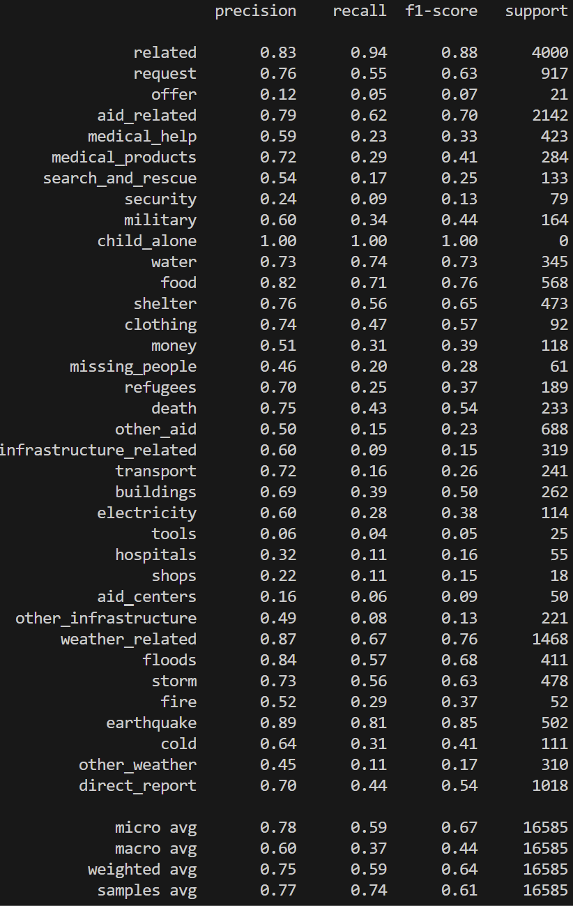

# Disaster Response Pipline

This project aims to take data from real world disaster data from tweets and direct messages and build a natural language processing tool that categorizes messages so the information gets to the right response organization or team.

## Table of Contents
- [Getting Started](#getting-started)
  - [Data](#data)
  - [Installing](#installing)
  - [Running ETL Script](#running-etl-script)
  - [Running NLP Script](#running-nlp-script)
  - [Running the Web App](#running-the-web-app)
- [Results](#results)
- [License](#license)

## Getting Started

### Data

This dataset contains nearly 30,000 messages drawn from events including an earthquake in Haiti in 2010, an earthquake in Chile in 2010, floods in Pakistan in 2010, super-storm Sandy in the U.S.A. in 2012, and news articles spanning a large number of years and 100s of different disasters.

The data has been encoded with 36 different categories related to disaster response and has been stripped of messages with sensitive information in their entirety.

Data includes 2 csv files:
- `disaster_messages.csv`: Messages data.
- `disaster_categories.csv`: Disaster categories of messages.

### Installing

Clone this GitHub repository

Python 3+

Flask==2.3.2

Jinja2==3.1.2

joblib==1.2.0

nltk==3.8.1

numpy==1.24.3

pandas==2.0.1

plotly==5.14.1

regex==2023.5.5

requests==2.30.0

scikit-learn==1.2.2

sklearn==0.0.post5

SQLAlchemy==2.0.13

### Running ETL Script
#### process_data.py | ETL work-flow:

- Loads the messages and categories datasets
- Merges the two datasets
- Cleans the data
- Stores it in a SQLite database

#### Run Command
`python data/process_data.py  data/disaster_messages.csv data/disaster_categories.csv data/DisasterResponse.db`

### Running NLP Script
#### train_classifier.py | NLP work-flow:

- Loads data from the SQLite database
- Splits the dataset into training and test sets
- Builds a text processing and machine learning pipeline
- Trains and tunes a model using GridSearchCV
- Outputs results on the test set
- Exports the final model as a pickle file

#### Run Command
`python models/train_classifier.py data/DisasterResponse.db data/classifier.pkl`

### Running the Web App
#### Run Command
`python run.py`

Go to http://0.0.0.0:3001/

## Results:
### NLP:

### Website:

## License:
This project is licensed under the MIT License - see the LICENSE file for details.

